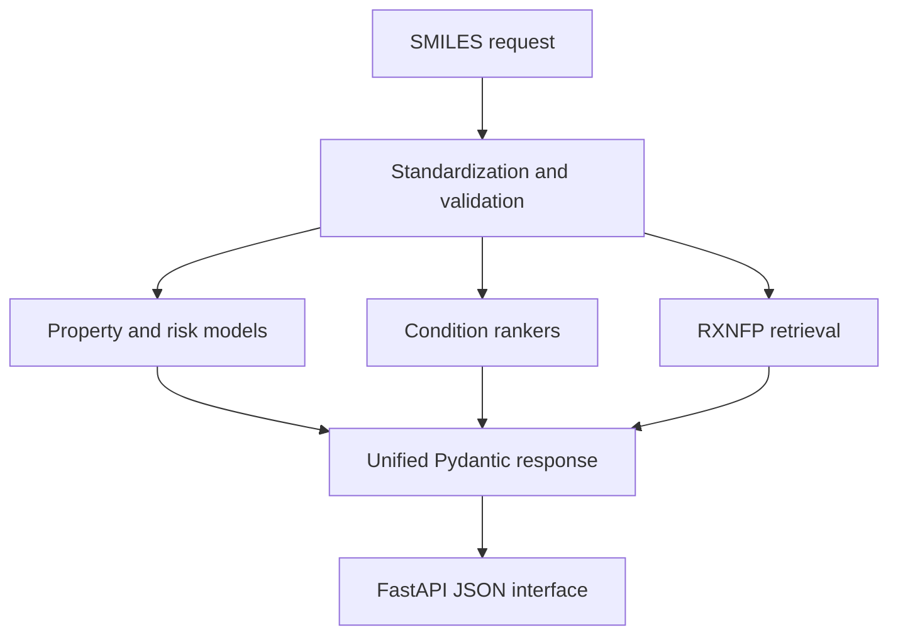
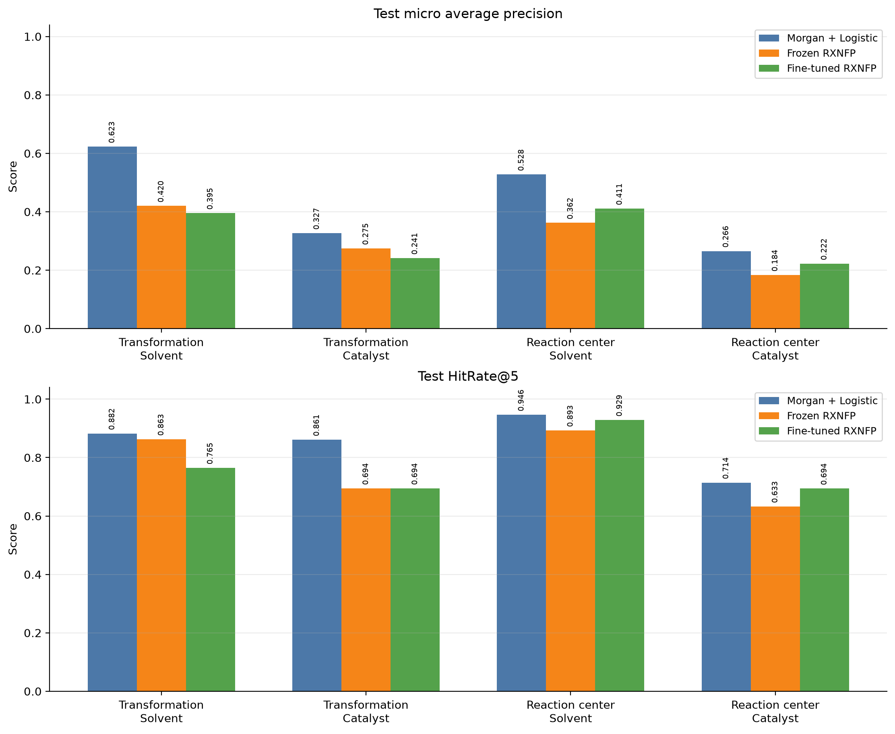
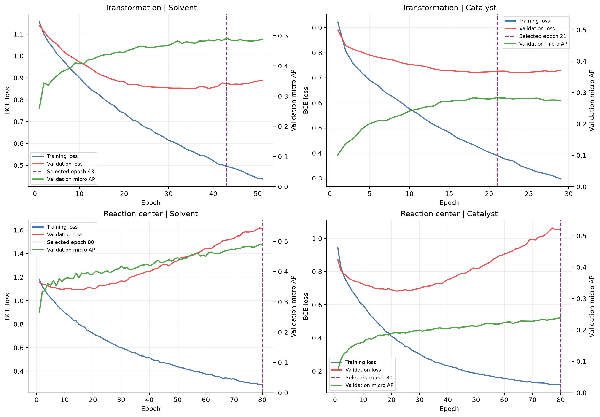
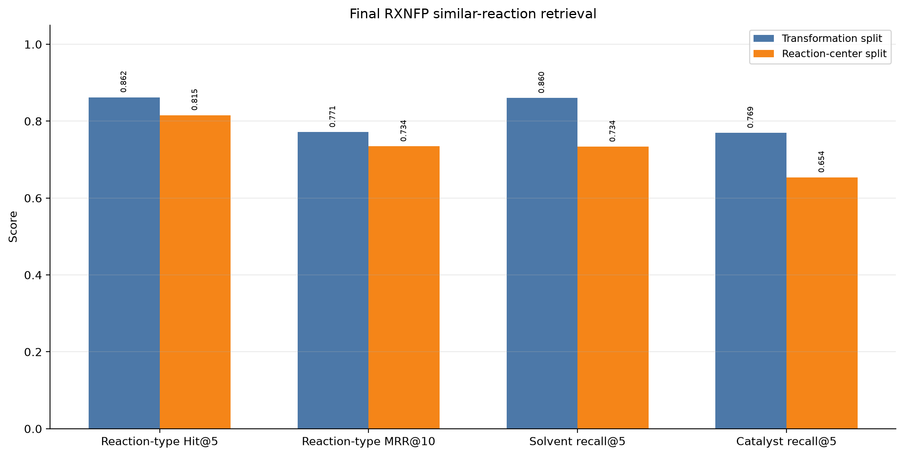

# ChemPilot

ChemPilot is a reproducible molecular machine-learning system
that connects aqueous-solubility prediction, lightweight
synthesis-risk assessment, reaction-condition recommendation,
and similar-reaction retrieval through one inference API.

> ChemPilot supports scientific prioritization. It does not
> provide a calibrated reaction-success probability, guaranteed
> synthetic feasibility, or multi-step retrosynthesis planning.

## Six reading anchors

1. [Problem](#1-problem)
2. [Architecture](#2-architecture)
3. [Data](#3-data)
4. [Key results](#4-key-results)
5. [Reproduction](#5-reproduction)
6. [Demo and documentation](#6-demo-and-documentation)

## 1. Problem

Early molecular design requires both property estimates and
evidence about how a target transformation might be performed.
These outputs are often produced by disconnected tools without
clear applicability warnings. ChemPilot provides one auditable
workflow that accepts molecular SMILES and, optionally,
reactants plus target products.

A molecule request returns LogS, interpretable descriptors,
Lipinski rules, SA score, rare-fragment and complexity signals,
and a lightweight synthesis-risk interpretation. A reaction
request additionally returns independent Top-K solvent and
catalyst rankings, applicability information, qualitative
confidence, and similar historical reactions.

## 2. Architecture



The implementation combines `BaseFeaturizer`, `BasePredictor`,
`ModelRegistry`, and `PredictionService`. YAML configuration
controls artifact paths, protocols, devices, applicability
thresholds, and synthesis-risk thresholds. Large components are
loaded lazily only when requested.

```text
configs/                  Dataset and inference configuration
data/                     Reconstructable local data products
reports/                  Audits, tables, figures, and model documentation
scripts/                  Data, training, reporting, and serving entry points
src/chempilot/            Reusable features, models, retrieval, API, and services
tests/                    Scientific and software contract tests
```

## 3. Data

| Dataset | Purpose | Scale | Main safeguards |
|---|---|---:|---|
| TDC Solubility_AqSolDB | Aqueous LogS regression | 9,982 molecules | Canonicalization, audit flags, fixed test set, random and scaffold protocols |
| ORD d9297630 snapshot | Condition ranking and retrieval | 39,347 standardized experiments; 602 transformations | Pinned source hash, group-aware splits, train-only vocabularies, leakage-free reaction inputs |

The AqSolDB drug-like analysis scope contains 8,721 molecules,
but all 9,982 records remain in the official benchmark. The ORD
response is LC area percent at 280 nm; it is not treated or
reported as isolated reaction yield.

See the [data card](reports/day7/DATA_CARD.md) for provenance,
processing decisions, leakage controls, and known data limits.

## 4. Key results

| Task | Preferred model | Protocol | Test result |
|---|---|---|---:|
| Solubility | XGBoost, RDKit + ECFP | Random | MAE 0.6742 |
| Solubility | XGBoost, RDKit + ECFP | Scaffold | MAE 0.7944 |
| Solvent recommendation | Morgan logistic | Transformation | Micro AP 0.6229; HitRate@5 0.8824 |
| Catalyst recommendation | Morgan logistic | Transformation | Micro AP 0.3268; HitRate@5 0.8611 |
| Similar-reaction retrieval | Frozen RXNFP CLS | Transformation | Reaction-type Hit@5 0.8621 |

Tree models outperformed the GINE ensemble on this approximately
10,000-molecule property task. Morgan fingerprints also
outperformed frozen and partially fine-tuned RXNFP for direct
condition classification, while RXNFP remained useful for
retrieval. Negative Transformer results are retained rather than
selecting models using test performance.




See the [model card](reports/day7/MODEL_CARD.md) and
[known limitations](reports/day7/KNOWN_LIMITATIONS.md) for the
intended use and responsible interpretation.

## 5. Reproduction

ChemPilot uses two environments because the property/GINE stack
is based on Python 3.10 while `ord-schema==0.6.3` requires
Python 3.11.

```bash
# Days 1–3
conda env create -f environment.yml
conda activate chempilot
python -m pip install -e . --no-deps

# Days 4–6
conda env create -f environment-ord.yml
conda activate chempilot-ord
python -m pip install -e . --no-deps
```

The detailed sections below provide every data, training,
evaluation, and inference command. Day 7 verified the workflow
from fresh environments and documents exact matches, numerical
tolerances, rendering differences, and non-bitwise model
reproduction in the
[reproducibility report](reports/day7/day7_reproducibility_report.md).

## 6. Demo and documentation

Start the API and open `http://127.0.0.1:8000/docs`:

```bash
conda activate chempilot-ord
python scripts/serve_chempilot.py --host 127.0.0.1 --port 8000
```

The tracked examples are available in
[`reports/day6/examples`](reports/day6/examples). Presentation
materials include a [1–2 minute demo script](reports/day7/DEMO_SCRIPT.md),
[3-minute introduction](reports/day7/PRESENTATION_3MIN.md), and
[8-minute introduction](reports/day7/PRESENTATION_8MIN.md).

The full Day 7 documentation also records
[compute resources](reports/day7/COMPUTE_RESOURCES.md).

## Installation

Days 1–3 use the Python 3.10 environment with the molecular
property and PyTorch Geometric dependencies:

```bash
conda env create -f environment.yml
conda activate chempilot
python -m pip install -e . --no-deps
```

Days 4–6 use a separate Python 3.11 environment for the Open
Reaction Database pipeline, reaction Transformer,
similar-reaction retrieval, and unified FastAPI service:

```bash
conda env create -f environment-ord.yml
conda activate chempilot-ord
python -m pip install -e . --no-deps
```

The environments intentionally remain separate. The
`chempilot-ord` environment includes PyTorch and Transformers
for RXNFP but does not include the PyTorch Geometric stack used
by the Day 3 GINE model. The `chempilot` environment does not
include `ord-schema`.


## Reproduce Day 1

```bash
python scripts/download_tdc.py
python scripts/inspect_raw_data.py
python scripts/standardize_smiles.py
python scripts/generate_eda.py
python scripts/create_splits.py
```

## Reproduce Day 2

Build deterministic label-independent features:

```bash
python scripts/build_features.py
```

Train the linear baselines:

```bash
python scripts/train_linear_baselines.py --split all
```

Train Random Forest:

```bash
python scripts/train_random_forest.py \
  --split all \
  --representation all
```

Train XGBoost on CPU:

```bash
python scripts/train_xgboost.py \
  --split all \
  --representation all \
  --device cpu
```

A CUDA-capable environment can instead use:

```bash
CUDA_VISIBLE_DEVICES=0 \
python scripts/train_xgboost.py \
  --split all \
  --representation all \
  --device cuda:0
```

Generate consolidated tables, figures, and failure analysis:

```bash
python scripts/summarize_day2.py
```

Run tests:

```bash
python -m pytest -v
```

## Day 3: molecular graph neural network

Day 3 implements an edge-aware GINE regressor using PyTorch
Geometric. Canonical SMILES are represented as molecular graphs
with atoms as nodes and directed chemical bonds as edges.

Node features include atomic number, degree, valence, formal
charge, hybridization, aromaticity, and chirality. Edge features
include bond type, conjugation, ring membership, and
stereochemistry.

The graph cache contains 9,982 graphs, 173,500 atoms, and 352,000
directed edges. The main four-layer GINE model contains 305,541
trainable parameters.

Development epochs were selected using validation MAE. Fresh
models were then trained on train plus validation for the fixed
selected epoch count and evaluated on the untouched test set
using seeds 1, 2, and 3.

### GINE versus XGBoost

| Protocol | XGBoost MAE | GINE three-seed MAE | GINE ensemble MAE |
|---|---:|---:|---:|
| Random | **0.6742** | 0.8232 ± 0.0495 | 0.7847 |
| Scaffold | **0.7944** | 0.9264 ± 0.1040 | 0.8879 |

The intervals shown for GINE are 95% Student-t confidence
intervals across three initialization seeds. The ensemble result
is the MAE after averaging the three GINE predictions.

Paired bootstrap analysis confirmed that the ensemble GINE MAE
was higher than XGBoost by 0.1105 on random data
(95% CI 0.0692–0.1575) and by 0.0935 on scaffold data
(95% CI 0.0522–0.1377).

GINE learned meaningful molecular rankings but produced unstable
extreme predictions for very large, multi-fragment, inorganic,
and non-drug-like structures. For this approximately 10,000
sample task, XGBoost with ECFP and explicit physicochemical
descriptors is therefore the preferred production model.

See the
[complete Day 3 report](reports/day3/day3_gine_report.md).

## Reproduce Day 3

Build the tensor-only molecular graph cache:

```bash
python scripts/build_graph_cache.py
```

Run validation-based development training:
```bash
CUDA_VISIBLE_DEVICES=0 \
python scripts/train_gine_development.py \
  --protocol random \
  --device cuda:0

CUDA_VISIBLE_DEVICES=0 \
python scripts/train_gine_development.py \
  --protocol scaffold \
  --device cuda:0
```

Run three-seed fixed-epoch final refits:
```bash
CUDA_VISIBLE_DEVICES=0 \
python scripts/train_gine_final.py \
  --protocol random \
  --device cuda:0

CUDA_VISIBLE_DEVICES=0 \
python scripts/train_gine_final.py \
  --protocol scaffold \
  --device cuda:0
```

Generate chemical-space analysis, figures, and the report:
```bash
python scripts/analyze_gine_subgroups.py
python scripts/plot_day3.py
python scripts/summarize_day3.py
```

For an NVIDIA driver compatible with CUDA 12.4, the tested
environment used PyTorch 2.6.0 with the CUDA 12.4 wheel and
PyTorch Geometric 2.8.0.post1.

## Day 4: reaction-condition recommendation

Day 4 builds a reaction-condition benchmark from the Open
Reaction Database (ORD). ORD data are distributed under the
[CC BY-SA 4.0 license](https://github.com/open-reaction-database/ord-data)
(`CC-BY-SA-4.0`).

The selected source is the d9297630 high-throughput screening
dataset associated with *Probing the chemical "reactome" with
high-throughput experimentation data*
(DOI: `10.1038/s41557-023-01393-w`).

The source repository revision is:

```text
ad4a2e12efacc9641ec14e7b2403acfd882bfe31
```

The selected Parquet file has the following SHA256:

```text
78c17145099d29458960ffcb6cec7a8987efeae06b100004be2255ff28e54994
```

The response variable is LC area percent at 280 nm. It is a
semi-quantitative analytical response and is not treated or
reported as isolated reaction yield.

### Reaction data pipeline

The pipeline standardizes:

- reaction IDs and reaction types
- atom-mapped reaction SMILES
- reactants and products
- reagents
- solvents
- catalysts
- temperature
- reaction time
- LC area percent
- transformation and reaction-center signatures

The processed benchmark contains:

| Quantity | Value |
|---|---:|
| Standardized experiments | 39,347 |
| Aggregated transformation-condition pairs | 34,566 |
| Unique transformations | 602 |
| Consensus reaction-center signatures | 514 |
| Rankable transformations | 381 |

Exact transformation-condition replicates are aggregated.
Different conditions for the same transformation are retained
because they contain screening information.

Missing temperature and reaction-time values remain missing and
are represented explicitly in condition features. They are not
filled with global averages.

### Leakage-controlled protocols

Two deterministic group-aware split protocols are reported:

- **Transformation split:** exact standardized transformations
  do not overlap across train, validation, and test.
- **Reaction-center split:** neither exact transformations nor
  consensus reaction-center signatures overlap across subsets.

Both protocols use approximately 70%/15%/15% condition-pair
splits with seed 42. Candidate assignments are selected using
group sizes and row counts only. Reaction scores, condition
ranks, and test labels are not used for split selection.

### Reaction and condition features

The reaction representation has 6,144 dimensions:

- 2,048-bit reactant Morgan fingerprint
- 2,048-bit product Morgan fingerprint
- 2,048-dimensional signed product-minus-reactant difference

The condition representation contains molecular fingerprints
and stable SHA256-hashed name features for solvents, catalysts,
and reagents, together with temperature, reaction time, and
explicit missingness indicators.

The solvent and catalyst classifiers use only reaction features.
Condition labels, scores, ranks, and split identities are not
included in classifier inputs.

### Solvent and catalyst prediction

One-vs-rest logistic regression predicts the union of condition
labels observed among the top-quartile condition pairs for each
rankable transformation. Class weights address imbalance without
duplicating minority samples.

Label vocabularies are constructed from the original training
split only. Unknown validation or test labels are retained as
unknown and are not silently converted into negative labels.

| Protocol | Target | Classes | Micro AP | MRR | HitRate@5 | Frequency HitRate@5 |
|---|---|---:|---:|---:|---:|---:|
| Transformation | Solvent | 20 | 0.6229 | 0.6656 | 0.8824 | 0.8627 |
| Transformation | Catalyst | 248 | 0.3268 | 0.6406 | 0.8611 | 0.6944 |
| Reaction center | Solvent | 20 | 0.5276 | 0.6848 | 0.9464 | 0.7500 |
| Reaction center | Catalyst | 241 | 0.2655 | 0.6727 | 0.7143 | 0.5102 |

All four models exceed their corresponding frequency baseline
on test HitRate@5. Solvent prediction is more reliable than
catalyst prediction. Catalyst results remain exploratory because
hundreds of labels are learned from approximately two hundred
final training transformations.

Test metrics are conditional on the presence of at least one
known target label. Unknown-label coverage is reported
separately, particularly for catalyst prediction.

### Top-K inference and applicability domain

`ReactionConditionPredictor` returns:

- solvent Top-K labels
- catalyst Top-K labels
- uncalibrated ranking scores
- the nearest final-training reaction
- structural Tanimoto similarity
- an applicability-domain threshold
- an `in_domain` warning flag

The applicability threshold is the fifth percentile of
leave-one-out nearest-neighbor Tanimoto similarity in the final
train-plus-validation subset. Test labels are not used to set
this threshold.

Solvent and catalyst models are independent. Their separate
Top-1 outputs must not be interpreted as a jointly optimized
experimental condition.

See the
[complete Day 4 report](reports/day4/day4_reaction_condition_report.md).


## Reproduce Day 4

Create the dedicated Python 3.11 environment:

```bash
conda env create -f environment-ord.yml
conda activate chempilot-ord
python -m pip install -e . --no-deps
```

### Retrieve the pinned ORD source

Clone the exact ORD revision without initially downloading every
Git LFS object:

```bash
GIT_LFS_SKIP_SMUDGE=1 \
git clone \
  https://github.com/open-reaction-database/ord-data.git \
  /tmp/ord-data-source

git -C /tmp/ord-data-source \
  checkout \
  ad4a2e12efacc9641ec14e7b2403acfd882bfe31
```

Download the five candidate Parquet files used in the source
audit:

```bash
git -C /tmp/ord-data-source \
  -c lfs.url=https://github.com/open-reaction-database/ord-data.git/info/lfs \
  lfs pull \
  --include="data/48/ord_dataset-488402f6ec0d441ca2f7d6fabea7c220.parquet,data/47/ord_dataset-47eaacc46c3a4487bbdf99adb1a15e41.parquet,data/54/ord_dataset-5481550056a14935b76e031fb94b88be.parquet,data/80/ord_dataset-805ad863feef48579d95d86a728035f4.parquet,data/d9/ord_dataset-d92976309c3a48a3a64a4cf5e7048086.parquet" \
  --exclude=""
```

Verify the selected modeling source:

```bash
sha256sum \
  /tmp/ord-data-source/data/d9/ord_dataset-d92976309c3a48a3a64a4cf5e7048086.parquet
```

Expected SHA256:

```text
78c17145099d29458960ffcb6cec7a8987efeae06b100004be2255ff28e54994
```

The d9297630 dataset is the final modeling source. The 805ad863
dataset is retained for comparative measurement and
screen-structure audits. The other downloaded candidates support
the source-selection audit.

### Audit and build the reaction dataset

```bash
python scripts/audit_ord_candidates.py \
  --inputs \
  data/48/ord_dataset-488402f6ec0d441ca2f7d6fabea7c220.parquet \
  data/47/ord_dataset-47eaacc46c3a4487bbdf99adb1a15e41.parquet \
  data/54/ord_dataset-5481550056a14935b76e031fb94b88be.parquet \
  data/80/ord_dataset-805ad863feef48579d95d86a728035f4.parquet \
  data/d9/ord_dataset-d92976309c3a48a3a64a4cf5e7048086.parquet

python scripts/audit_ord_measurements.py
python scripts/audit_ord_screen_structure.py
python scripts/audit_ord_label_frequency.py
python scripts/build_ord_reaction_dataset.py
```

The build script verifies the selected source size and SHA256
before parsing it.

### Create leakage-controlled splits and features

```bash
python scripts/create_ord_reaction_splits.py
python scripts/build_reaction_features.py
python scripts/audit_reaction_label_space.py
python scripts/build_reaction_label_targets.py
```

### Select classifier regularization

Search the predefined regularization grid using validation data
only:

```bash
python scripts/search_reaction_condition_classifiers.py
```

The selected values are:

| Protocol | Target | C |
|---|---|---:|
| Transformation | Solvent | 0.1 |
| Transformation | Catalyst | 0.1 |
| Reaction center | Solvent | 0.1 |
| Reaction center | Catalyst | 1.0 |

### Final train-plus-validation refits

Train fresh final models on train plus validation and evaluate
the untouched test split once:

```bash
python scripts/train_reaction_condition_classifiers.py \
  --protocol transformation \
  --target solvent \
  --evaluation-split test \
  --c 0.1 \
  --include-valid-in-training \
  --n-jobs 8

python scripts/train_reaction_condition_classifiers.py \
  --protocol transformation \
  --target catalyst \
  --evaluation-split test \
  --c 0.1 \
  --include-valid-in-training \
  --n-jobs 8

python scripts/train_reaction_condition_classifiers.py \
  --protocol reaction_center \
  --target solvent \
  --evaluation-split test \
  --c 0.1 \
  --include-valid-in-training \
  --n-jobs 8

python scripts/train_reaction_condition_classifiers.py \
  --protocol reaction_center \
  --target catalyst \
  --evaluation-split test \
  --c 1.0 \
  --include-valid-in-training \
  --n-jobs 8
```

### Generate AD analysis, figures, and report

```bash
python scripts/analyze_reaction_applicability.py
python scripts/plot_day4.py
python scripts/summarize_day4.py
```

### Run Day 4 tests

```bash
python -m pytest \
  tests/test_reaction_features.py \
  tests/test_multilabel_evaluation.py \
  tests/test_applicability.py \
  tests/test_reaction_inference.py \
  -q
```

### Run Top-K inference

```bash
python scripts/predict_reaction_conditions.py \
  --reactant "Brc1ccc2ncccc2c1" \
  --reactant "O=S([O-])C1CC1.[Na+]" \
  --product "c1cnc2ccc(C3CC3)cc2c1" \
  --protocol reaction_center \
  --top-k 5
```

Generated ORD datasets, processed Parquet files, sparse feature
caches, and model binaries are excluded from Git. They can be
reconstructed from the pinned ORD revision and the commands
above.

## Day 5: reaction Transformer and similar-reaction retrieval

Day 5 evaluates a pretrained RXNFP reaction-SMILES Transformer
for solvent and catalyst recommendation and for similar-reaction
retrieval.

Each Transformer input is represented as sorted canonical
reactants followed by `>>` and sorted canonical products.
Reagents, solvents, catalysts, atom mappings, scores, and split
identities are excluded from the model input.

The 381 modeling transformations contain no invalid reaction
sequences and no RXNFP unknown tokens. A maximum length of 256
covers every modeling sequence without truncation.

The RXNFP `bert_pretrained` checkpoint contains 12 Transformer
layers, a hidden size of 256, four attention heads, and a
591-token reaction-SMILES vocabulary. The checkpoint is loaded
from the RXNFP 0.1.0 wheel with its source hashes and license
recorded in the Day 5 manifest.

### Frozen and partially fine-tuned RXNFP models

Frozen RXNFP representations were evaluated using both the CLS
embedding and masked-mean pooling. Pooling and logistic
regularization were selected using validation data only.

Partial fine-tuning keeps the embedding layer and Transformer
layers 0–9 frozen. Layers 10–11 and the multi-label classifier
head are trained using weighted BCE-with-logits loss. Positive
class weights are clipped at 20 to limit instability from rare
catalyst labels.

The following table compares untouched-test performance:

| Protocol | Target | Model | Micro AP | MRR | HitRate@5 |
|---|---|---|---:|---:|---:|
| Transformation | Solvent | Morgan + logistic | **0.6229** | **0.6656** | **0.8824** |
| Transformation | Solvent | Frozen RXNFP | 0.4200 | 0.6490 | 0.8627 |
| Transformation | Solvent | Fine-tuned RXNFP | 0.3954 | 0.5936 | 0.7647 |
| Transformation | Catalyst | Morgan + logistic | **0.3268** | **0.6406** | **0.8611** |
| Transformation | Catalyst | Frozen RXNFP | 0.2745 | 0.5307 | 0.6944 |
| Transformation | Catalyst | Fine-tuned RXNFP | 0.2413 | 0.5504 | 0.6944 |
| Reaction center | Solvent | Morgan + logistic | **0.5276** | **0.6848** | **0.9464** |
| Reaction center | Solvent | Frozen RXNFP | 0.3621 | 0.6459 | 0.8929 |
| Reaction center | Solvent | Fine-tuned RXNFP | 0.4107 | 0.6374 | 0.9286 |
| Reaction center | Catalyst | Morgan + logistic | **0.2655** | **0.6727** | **0.7143** |
| Reaction center | Catalyst | Frozen RXNFP | 0.1836 | 0.5068 | 0.6327 |
| Reaction center | Catalyst | Fine-tuned RXNFP | 0.2222 | 0.5256 | 0.6939 |

Morgan fingerprints remain the preferred representation for
direct condition classification. The Transformer models do not
improve test micro AP on this small, sparse multi-label dataset.
The validation-to-test decline and diverging training and
validation losses indicate limited-data overfitting during
partial fine-tuning.

This is retained as an informative negative result rather than
selecting a model using test performance.

### Similar-reaction retrieval

Frozen RXNFP embeddings are also used for exact cosine-similarity
retrieval. CLS pooling was selected on validation data and the
final index was constructed from train plus validation reactions.

| Protocol | Index reactions | Test queries | Reaction-type Hit@5 | MRR@10 | Solvent recall@5 | Catalyst recall@5 |
|---|---:|---:|---:|---:|---:|---:|
| Transformation | 323 | 58 | 0.8621 | 0.7714 | 0.8601 | 0.7695 |
| Reaction center | 316 | 65 | 0.8154 | 0.7344 | 0.7336 | 0.6537 |

The retrieval interface returns neighboring historical reactions
together with their best observed condition records. Retrieved
conditions are experimental precedents, not guaranteed optimal
conditions. Cosine similarity is a representation-space
similarity score and must not be interpreted as a probability of
reaction success.

The ORD analytical response remains LC area percent at 280 nm
and is not treated or reported as isolated reaction yield.

See the
[complete Day 5 report](reports/day5/day5_reaction_transformer_report.md).






## Reproduce Day 5

Activate the dedicated reaction environment:

```bash
conda activate chempilot-ord
python -m pip install -e . --no-deps
```

### Audit reaction sequences

```bash
python scripts/audit_reaction_sequences.py
```

### Prepare the pinned RXNFP checkpoint

Download the RXNFP 0.1.0 wheel without installing its historical
dependency set:

```bash
mkdir -p /tmp/rxnfp-wheel

python -m pip download \
  --no-deps \
  --only-binary=:all: \
  --dest /tmp/rxnfp-wheel \
  rxnfp==0.1.0
```

Extract and verify the pretrained checkpoint:

```bash
python scripts/prepare_rxnfp_pretrained.py \
  --wheel \
  /tmp/rxnfp-wheel/rxnfp-0.1.0-py3-none-any.whl
```

The expected wheel SHA256 is:

```text
c5c1e818add6f34539a6b29bc680c47c9e7311e9383d1b34ce901481e34b58cf
```

Audit the exact RXNFP tokenizer against all modeling reactions:

```bash
python scripts/audit_rxnfp_tokenization.py
```

### Build frozen RXNFP features

```bash
CUDA_VISIBLE_DEVICES=0 \
python scripts/build_reaction_transformer_features.py \
  --device cuda \
  --batch-size 32 \
  --max-length 256
```

### Select frozen classifiers

Search pooling and logistic regularization using validation data
only:

```bash
python scripts/search_reaction_transformer_classifiers.py \
  --n-jobs 8 \
  --max-iterations 1000
```

Evaluate the locked frozen configurations once on test:

```bash
python scripts/evaluate_frozen_rxnfp_final.py \
  --n-jobs 8 \
  --max-iterations 1000
```

### Partially fine-tune RXNFP

Run validation-based development training separately for each
protocol and target. For example:

```bash
CUDA_VISIBLE_DEVICES=0 \
python scripts/train_reaction_transformer_development.py \
  --protocol transformation \
  --target solvent \
  --device cuda \
  --batch-size 16 \
  --max-epochs 80 \
  --patience 8
```

Repeat for transformation/catalyst,
reaction_center/solvent, and reaction_center/catalyst. The fixed
epoch plan recorded in
`reports/day5/fine_tuning/final_training_plan.json` is selected
from these validation runs.

Fit train-plus-validation models for the fixed epoch counts and
evaluate each untouched test task once:

```bash
CUDA_VISIBLE_DEVICES=0 \
python scripts/train_reaction_transformer_final.py \
  --device cuda
```

### Build and evaluate similar-reaction retrieval

Select pooling using train-to-validation retrieval:

```bash
python scripts/evaluate_reaction_retrieval_validation.py
```

Build the final train-plus-validation indices and evaluate test
queries once:

```bash
python scripts/build_reaction_retrieval_final.py
```

Run an end-to-end query:

```bash
python scripts/retrieve_similar_reactions.py \
  --reactant "Brc1ccc2ncccc2c1" \
  --reactant "O=S([O-])C1CC1.[Na+]" \
  --product "c1cnc2ccc(C3CC3)cc2c1" \
  --protocol transformation \
  --top-k 5
```

### Generate Day 5 outputs

```bash
python scripts/plot_day5.py
python scripts/summarize_day5.py
```

Generated pretrained weights, embedding caches, fine-tuned model
binaries, and retrieval indices are excluded from Git. Their
provenance and hashes are recorded in tracked reports.

## Day 6: unified inference service

Day 6 combines the molecular-property and reaction models from
Days 1–5 behind one configuration-driven inference interface.

A molecule SMILES request returns canonical SMILES, interpretable
RDKit descriptors, aqueous-solubility prediction, Lipinski
drug-likeness, SA score, rare-fragment count, molecular
complexity, and a lightweight synthesizability-risk assessment.

When reactants and target products are supplied, the service also
returns Top-K solvent and catalyst rankings from the preferred
Day 4 Morgan models, applicability-domain information, similar
historical reactions from the Day 5 RXNFP index, qualitative
confidence, and context-aware synthesis risk.

### Composition and configuration

The service uses four main composition interfaces:

- `BaseFeaturizer` defines and validates feature dimensions,
  names, row alignment, and finite values.
- `BasePredictor` defines a reusable prediction contract.
- `ModelRegistry` resolves YAML configuration and lazily loads
  and caches model components.
- `PredictionService` coordinates molecule and reaction
  inference and returns strict Pydantic response schemas.

Model paths, supported protocols, device selection, molecular
scope, and synthesis-risk thresholds are controlled through
`configs/inference.yaml`. Large models and feature caches are
loaded only when their associated functionality is requested.

The production components are:

- Day 2 scaffold-split XGBoost for aqueous LogS prediction;
- Day 4 Morgan logistic models for direct condition ranking;
- Day 5 frozen RXNFP CLS embeddings for historical-reaction
  retrieval.

### Molecular inference

The solubility predictor reproduces the selected Day 2 model
contract exactly: ten global RDKit descriptors followed by 2,048
ECFP4/Morgan bits, giving 2,058 `float32` input features.

The tracked aspirin example predicts LogS approximately -1.9036
log10(mol/L), passes all four Lipinski criteria, has an SA score
of approximately 1.58, and receives a low structural
synthesis-risk rating.

The molecular applicability scope reproduces the Day 1 rules:
valid SMILES, one molecular fragment, at least one carbon atom,
only configured common elements, and molecular weight from 50 to
1,000 inclusive. Out-of-scope predictions are returned with an
explicit reliability warning rather than silently discarded.

### Reaction inference

Reaction requests return independent Top-K solvent and catalyst
rankings, Day 4 applicability-domain information, and Day 5
similar historical reactions with their best recorded condition
evidence.

Condition uncertainty is derived from the Top-1 versus Top-2
ranking margins for solvent and catalyst. Qualitative confidence
combines this uncertainty with condition-model applicability and
nearest historical RXNFP similarity.

The tracked reaction example has nearest historical RXNFP
similarity of approximately 0.9617. Although both condition
models are in domain, the condition-ranking uncertainty is high,
so the overall qualitative confidence is low. This demonstrates
why similarity, applicability, and ranking separation are
reported separately.

### Scientific interpretation

The synthesizability output combines SA score, rare fragments,
Bertz molecular complexity, historical similarity, and condition
ranking uncertainty. It is a lightweight risk assessment and is
not a multi-step retrosynthesis plan or a guarantee of
experimental feasibility.

Solvent and catalyst are predicted independently and are not a
jointly optimized condition. Condition ranking scores are not
calibrated probabilities. RXNFP cosine similarity is not a
probability of reaction success. ORD LC area percent at 280 nm is
not isolated reaction yield.

### FastAPI interface

FastAPI provides a structured JSON interface:

| Method | Path | Purpose |
|---|---|---|
| `GET` | `/health` | Check artifact availability without loading models |
| `POST` | `/v1/predict` | Run molecule-only, reaction-only, or combined inference |
| `GET` | `/docs` | Open interactive API documentation |
| `GET` | `/openapi.json` | Retrieve the machine-readable API schema |

Every HTTP response carries an `X-Request-ID` for logging and
request tracing. Invalid SMILES and malformed reaction requests
return HTTP 422. Missing or incompatible model artifacts return
HTTP 503. Configuration and unexpected internal failures return
sanitized HTTP 500 responses.

See the
[complete Day 6 report](reports/day6/day6_unified_inference_report.md).

Tracked molecule and reaction responses are available in
[`reports/day6/examples`](reports/day6/examples).

## Reproduce Day 6

Activate the reaction and inference environment:

```bash
conda activate chempilot-ord
python -m pip install -e . --no-deps
```

Generate the fixed molecule and reaction examples and report:

```bash
python scripts/generate_day6_examples.py
python scripts/summarize_day6.py
```

Start the local API:

```bash
python scripts/serve_chempilot.py \
  --host 127.0.0.1 \
  --port 8000
```

Interactive documentation is then available at
`http://127.0.0.1:8000/docs`.

Run molecule inference over HTTP:

```bash
curl -X POST \
  http://127.0.0.1:8000/v1/predict \
  -H "Content-Type: application/json" \
  -H "X-Request-ID: readme-molecule-example" \
  -d '{
    "molecule_smiles": "CC(=O)Oc1ccccc1C(=O)O"
  }'
```

Run reaction inference over HTTP:

```bash
curl -X POST \
  http://127.0.0.1:8000/v1/predict \
  -H "Content-Type: application/json" \
  -H "X-Request-ID: readme-reaction-example" \
  -d '{
    "reactant_smiles": [
      "Brc1ccc2ncccc2c1",
      "O=S([O-])C1CC1.[Na+]"
    ],
    "product_smiles": [
      "c1cnc2ccc(C3CC3)cc2c1"
    ],
    "reaction_protocol": "reaction_center",
    "top_k": 5
  }'
```

Run the focused Day 6 tests:

```bash
python -m pytest \
  tests/test_service_base.py \
  tests/test_service_schemas.py \
  tests/test_molecule_service.py \
  tests/test_solubility_service.py \
  tests/test_model_registry.py \
  tests/test_prediction_service.py \
  tests/test_api.py \
  tests/test_openapi.py \
  -q
```

Generated model binaries, pretrained checkpoints, reaction
indices, and feature caches remain excluded from Git. The tracked
configuration, reports, and example responses document their
expected paths and interpretation.


## Day 7: clean-environment reproduction and handoff

Day 7 rebuilt Days 1–6 in fresh Python 3.10 and Python 3.11
environments. Stable data tables, split membership, and feature
arrays reproduced exactly. Random Forest results reproduced to
floating-point precision, while Ridge and XGBoost showed small,
documented numerical drift. Plot bytes and wall-clock timings are
treated as environment-dependent rather than scientific
contracts.

The final handoff documents are:

- [Reproducibility report](reports/day7/day7_reproducibility_report.md)
- [Data card](reports/day7/DATA_CARD.md)
- [Model card](reports/day7/MODEL_CARD.md)
- [Known limitations and failure cases](reports/day7/KNOWN_LIMITATIONS.md)
- [Compute resources](reports/day7/COMPUTE_RESOURCES.md)
- [Demo script](reports/day7/DEMO_SCRIPT.md)
- [Three-minute introduction](reports/day7/PRESENTATION_3MIN.md)
- [Eight-minute introduction](reports/day7/PRESENTATION_8MIN.md)

## Reproducibility controls

ChemPilot records dataset hashes, feature parameters, software versions, fixed sample IDs, validation searches, sample-level failure cases, and training times. Feature scaling is fitted only on training data. Test labels are not used for hyperparameter selection.

Generated datasets, feature caches, model binaries, and full sample-level prediction files are excluded from Git because they can be reconstructed using the documented commands.

## Roadmap

- [x] Graph neural network property prediction
- [x] Reaction-condition dataset and classical multi-label baseline
- [x] Reaction-condition Top-K inference and applicability warning
- [x] Transformer-based condition recommendation benchmark
- [x] RXNFP similar-reaction retrieval
- [ ] Joint solvent-catalyst condition ranking
- [ ] Reagent and temperature prediction
- [x] Unified inference API and lightweight synthesizability scoring
