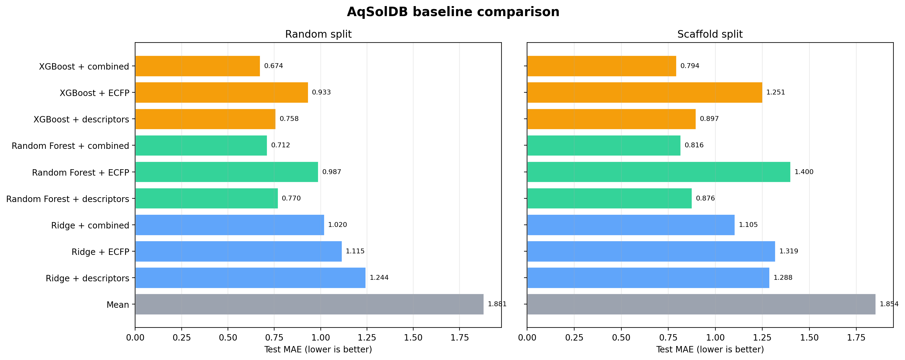
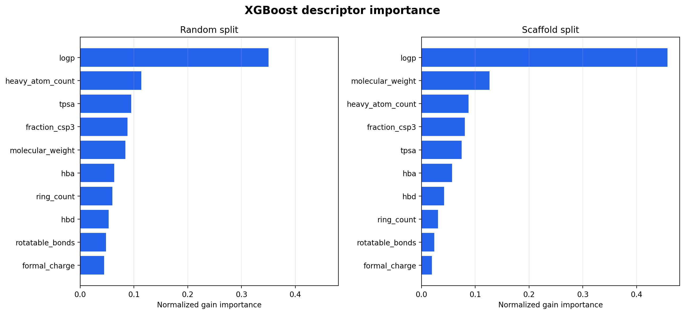
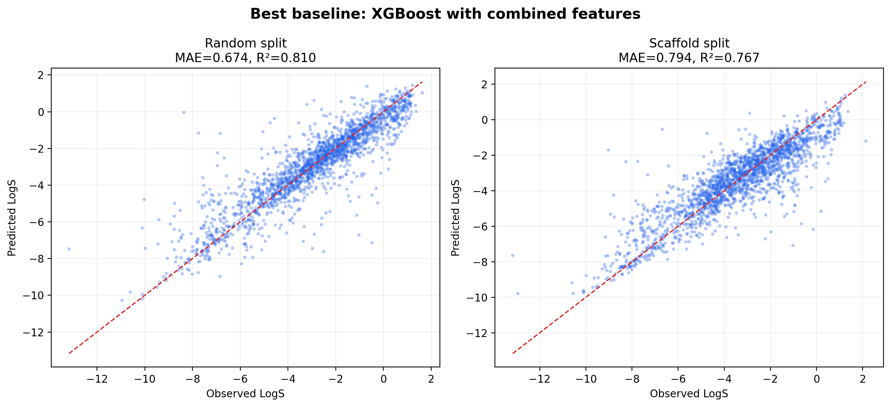
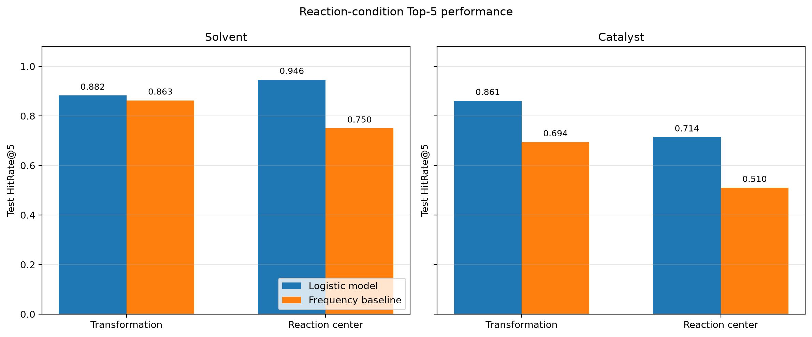
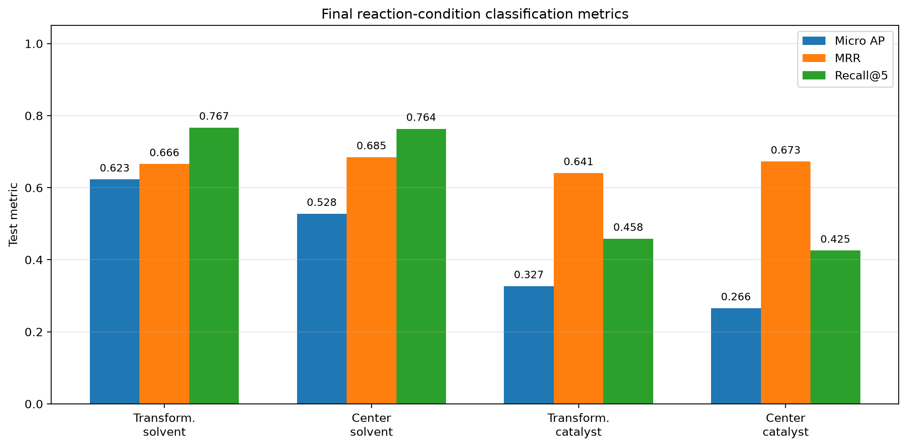
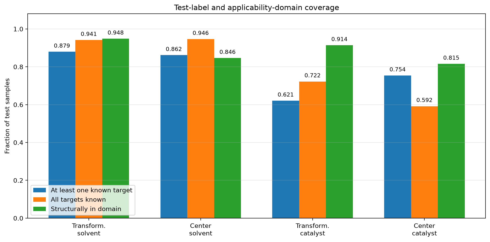

# ChemPilot

ChemPilot is a reproducible molecular machine-learning project for drug-property prediction, synthesis-feasibility assessment, and reaction-condition recommendation.

The current milestone establishes strong aqueous-solubility baselines on TDC Solubility_AqSolDB. Subsequent milestones will extend the same evaluation framework to graph neural networks, reaction-condition prediction, and retrieval-supported recommendations.

## Current task

- Input: molecular SMILES
- Output: aqueous solubility LogS
- Unit: log10(mol/L)
- Task type: regression
- Dataset size: 9,982 compounds
- Primary metric: mean absolute error
- Representations: RDKit descriptors, ECFP4, and their concatenation
- Models: Mean, Ridge, Random Forest, and XGBoost

## Best baseline results

| Split protocol | Model | Features | MAE | RMSE | R² | Spearman |
|---|---|---|---:|---:|---:|---:|
| Random | XGBoost | RDKit + ECFP | 0.6742 | 1.0257 | 0.8102 | 0.9032 |
| Scaffold | XGBoost | RDKit + ECFP | 0.7944 | 1.1066 | 0.7674 | 0.8559 |

Hyperparameters are selected using validation MAE. The selected configuration is then refitted on the combined training and validation data before evaluation on the held-out test set.

Random and scaffold results are reported separately because they do not use the same test samples and therefore should not be interpreted as a controlled one-variable comparison.



## Main findings

Combining global physicochemical descriptors with local ECFP substructure fingerprints consistently produced the strongest results. XGBoost slightly outperformed Random Forest under both protocols.

Descriptor-only tree models remained highly competitive while requiring substantially less training time. ECFP-only models transferred poorly to the scaffold protocol, suggesting that local substructure patterns alone do not provide reliable extrapolation to unfamiliar molecular frameworks.

LogP was the most important descriptor for both Random Forest and XGBoost. This agrees with the exploratory Spearman correlation of −0.7399 between MolLogP and LogS.





## Failure and applicability-domain analysis

The best model performed substantially better inside the defined drug-like analysis scope:

| Split | Scope | Samples | MAE | RMSE |
|---|---|---:|---:|---:|
| Random | Drug-like | 1,738 | 0.5920 | 0.8664 |
| Random | Outside scope | 259 | 1.2256 | 1.7536 |
| Scaffold | Drug-like | 1,815 | 0.7373 | 0.9952 |
| Scaffold | Outside scope | 182 | 1.3639 | 1.8868 |

Large errors were enriched for uncommon elements, charged dyes, salts, mixtures, highly halogenated compounds, and extreme LogS values. These samples are retained in the official benchmark, but future inference should return an applicability-domain warning.

See the [complete Day 2 report](reports/day2/day2_baseline_report.md).

## Day 1: data pipeline

The data pipeline performs:

1. Dataset download through PyTDC
2. Immutable raw-data snapshot and SHA-256 provenance
3. SMILES validity and duplicate auditing
4. Conservative canonical SMILES standardization
5. Salt, mixture, charge, and uncommon-element flags
6. Exploratory analysis with RDKit descriptors
7. Random and official scaffold split generation
8. Sample-overlap and scaffold-overlap auditing

No fragments are removed and no charges are neutralized.

Two scopes are retained:

- Official benchmark scope: all 9,982 compounds
- Drug-like analysis scope: 8,721 compounds

The drug-like flag supports subgroup analysis and does not replace the official benchmark.

See the [EDA report](reports/eda_solubility.md).

## Split protocols

The diagnostic random protocol uses a label-stratified 70/10/20 split with seed 42. It is not comparable with the TDC leaderboard because molecular scaffolds overlap across its subsets.

The official TDC test set contains 1,997 compounds. A split audit identified an important characteristic of the default seed-42 development split: all 2,940 validation molecules have an empty Bemis–Murcko scaffold. The validation labels also have a strong distribution shift. This limitation is retained and documented rather than silently changing the official protocol.

## Project structure

```text
configs/                  Dataset and experiment configuration
data/                     Reproducible local data products
reports/                  Audits, result tables, figures, and analyses
scripts/                  Download, feature, training, and reporting entry points
src/chempilot/            Reusable data, feature, and evaluation modules
tests/                    Unit tests for features, alignment, and metrics
```

## Installation

Days 1–3 use the Python 3.10 environment with the molecular
property and PyTorch Geometric dependencies:

```bash
conda env create -f environment.yml
conda activate chempilot
python -m pip install -e . --no-deps
```

Day 4 uses a separate Python 3.11 environment for the Open
Reaction Database schema and reaction-condition pipeline:

```bash
conda env create -f environment-ord.yml
conda activate chempilot-ord
python -m pip install -e . --no-deps
```

The environments intentionally remain separate. The
`chempilot-ord` environment does not include the PyTorch
dependencies needed by the Day 3 GINE model, while the
`chempilot` environment does not include `ord-schema`.


## Reproduce Day 1

```bash
python scripts/download_tdc.py
python scripts/inspect_raw_data.py
python scripts/standardize_smiles.py
python scripts/generate_eda.py
python scripts/create_splits.py
```

## Reproduce Day 2

Build deterministic label-independent features:

```bash
python scripts/build_features.py
```

Train the linear baselines:

```bash
python scripts/train_linear_baselines.py --split all
```

Train Random Forest:

```bash
python scripts/train_random_forest.py \
  --split all \
  --representation all
```

Train XGBoost on CPU:

```bash
python scripts/train_xgboost.py \
  --split all \
  --representation all \
  --device cpu
```

A CUDA-capable environment can instead use:

```bash
CUDA_VISIBLE_DEVICES=0 \
python scripts/train_xgboost.py \
  --split all \
  --representation all \
  --device cuda:0
```

Generate consolidated tables, figures, and failure analysis:

```bash
python scripts/summarize_day2.py
```

Run tests:

```bash
python -m pytest -v
```

## Day 3: molecular graph neural network

Day 3 implements an edge-aware GINE regressor using PyTorch
Geometric. Canonical SMILES are represented as molecular graphs
with atoms as nodes and directed chemical bonds as edges.

Node features include atomic number, degree, valence, formal
charge, hybridization, aromaticity, and chirality. Edge features
include bond type, conjugation, ring membership, and
stereochemistry.

The graph cache contains 9,982 graphs, 173,500 atoms, and 352,000
directed edges. The main four-layer GINE model contains 305,541
trainable parameters.

Development epochs were selected using validation MAE. Fresh
models were then trained on train plus validation for the fixed
selected epoch count and evaluated on the untouched test set
using seeds 1, 2, and 3.

### GINE versus XGBoost

| Protocol | XGBoost MAE | GINE three-seed MAE | GINE ensemble MAE |
|---|---:|---:|---:|
| Random | **0.6742** | 0.8232 ± 0.0495 | 0.7847 |
| Scaffold | **0.7944** | 0.9264 ± 0.1040 | 0.8879 |

The intervals shown for GINE are 95% Student-t confidence
intervals across three initialization seeds. The ensemble result
is the MAE after averaging the three GINE predictions.

Paired bootstrap analysis confirmed that the ensemble GINE MAE
was higher than XGBoost by 0.1105 on random data
(95% CI 0.0692–0.1575) and by 0.0935 on scaffold data
(95% CI 0.0522–0.1377).

GINE learned meaningful molecular rankings but produced unstable
extreme predictions for very large, multi-fragment, inorganic,
and non-drug-like structures. For this approximately 10,000
sample task, XGBoost with ECFP and explicit physicochemical
descriptors is therefore the preferred production model.

See the
[complete Day 3 report](reports/day3/day3_gine_report.md).

## Reproduce Day 3

Build the tensor-only molecular graph cache:

```bash
python scripts/build_graph_cache.py
```

Run validation-based development training:
```bash
CUDA_VISIBLE_DEVICES=0 \
python scripts/train_gine_development.py \
  --protocol random \
  --device cuda:0

CUDA_VISIBLE_DEVICES=0 \
python scripts/train_gine_development.py \
  --protocol scaffold \
  --device cuda:0
```

Run three-seed fixed-epoch final refits:
```bash
CUDA_VISIBLE_DEVICES=0 \
python scripts/train_gine_final.py \
  --protocol random \
  --device cuda:0

CUDA_VISIBLE_DEVICES=0 \
python scripts/train_gine_final.py \
  --protocol scaffold \
  --device cuda:0
```

Generate chemical-space analysis, figures, and the report:
```bash
python scripts/analyze_gine_subgroups.py
python scripts/plot_day3.py
python scripts/summarize_day3.py
```

For an NVIDIA driver compatible with CUDA 12.4, the tested
environment used PyTorch 2.6.0 with the CUDA 12.4 wheel and
PyTorch Geometric 2.8.0.post1.

## Day 4: reaction-condition recommendation

Day 4 builds a reaction-condition benchmark from the Open
Reaction Database (ORD). ORD data are distributed under the
[CC BY-SA 4.0 license](https://github.com/open-reaction-database/ord-data)
(`CC-BY-SA-4.0`).

The selected source is the d9297630 high-throughput screening
dataset associated with *Probing the chemical "reactome" with
high-throughput experimentation data*
(DOI: `10.1038/s41557-023-01393-w`).

The source repository revision is:

```text
ad4a2e12efacc9641ec14e7b2403acfd882bfe31
```

The selected Parquet file has the following SHA256:

```text
78c17145099d29458960ffcb6cec7a8987efeae06b100004be2255ff28e54994
```

The response variable is LC area percent at 280 nm. It is a
semi-quantitative analytical response and is not treated or
reported as isolated reaction yield.

### Reaction data pipeline

The pipeline standardizes:

- reaction IDs and reaction types
- atom-mapped reaction SMILES
- reactants and products
- reagents
- solvents
- catalysts
- temperature
- reaction time
- LC area percent
- transformation and reaction-center signatures

The processed benchmark contains:

| Quantity | Value |
|---|---:|
| Standardized experiments | 39,347 |
| Aggregated transformation-condition pairs | 34,566 |
| Unique transformations | 602 |
| Consensus reaction-center signatures | 514 |
| Rankable transformations | 381 |

Exact transformation-condition replicates are aggregated.
Different conditions for the same transformation are retained
because they contain screening information.

Missing temperature and reaction-time values remain missing and
are represented explicitly in condition features. They are not
filled with global averages.

### Leakage-controlled protocols

Two deterministic group-aware split protocols are reported:

- **Transformation split:** exact standardized transformations
  do not overlap across train, validation, and test.
- **Reaction-center split:** neither exact transformations nor
  consensus reaction-center signatures overlap across subsets.

Both protocols use approximately 70%/15%/15% condition-pair
splits with seed 42. Candidate assignments are selected using
group sizes and row counts only. Reaction scores, condition
ranks, and test labels are not used for split selection.

### Reaction and condition features

The reaction representation has 6,144 dimensions:

- 2,048-bit reactant Morgan fingerprint
- 2,048-bit product Morgan fingerprint
- 2,048-dimensional signed product-minus-reactant difference

The condition representation contains molecular fingerprints
and stable SHA256-hashed name features for solvents, catalysts,
and reagents, together with temperature, reaction time, and
explicit missingness indicators.

The solvent and catalyst classifiers use only reaction features.
Condition labels, scores, ranks, and split identities are not
included in classifier inputs.

### Solvent and catalyst prediction

One-vs-rest logistic regression predicts the union of condition
labels observed among the top-quartile condition pairs for each
rankable transformation. Class weights address imbalance without
duplicating minority samples.

Label vocabularies are constructed from the original training
split only. Unknown validation or test labels are retained as
unknown and are not silently converted into negative labels.

| Protocol | Target | Classes | Micro AP | MRR | HitRate@5 | Frequency HitRate@5 |
|---|---|---:|---:|---:|---:|---:|
| Transformation | Solvent | 20 | 0.6229 | 0.6656 | 0.8824 | 0.8627 |
| Transformation | Catalyst | 248 | 0.3268 | 0.6406 | 0.8611 | 0.6944 |
| Reaction center | Solvent | 20 | 0.5276 | 0.6848 | 0.9464 | 0.7500 |
| Reaction center | Catalyst | 241 | 0.2655 | 0.6727 | 0.7143 | 0.5102 |

All four models exceed their corresponding frequency baseline
on test HitRate@5. Solvent prediction is more reliable than
catalyst prediction. Catalyst results remain exploratory because
hundreds of labels are learned from approximately two hundred
final training transformations.

Test metrics are conditional on the presence of at least one
known target label. Unknown-label coverage is reported
separately, particularly for catalyst prediction.

### Top-K inference and applicability domain

`ReactionConditionPredictor` returns:

- solvent Top-K labels
- catalyst Top-K labels
- uncalibrated ranking scores
- the nearest final-training reaction
- structural Tanimoto similarity
- an applicability-domain threshold
- an `in_domain` warning flag

The applicability threshold is the fifth percentile of
leave-one-out nearest-neighbor Tanimoto similarity in the final
train-plus-validation subset. Test labels are not used to set
this threshold.

Solvent and catalyst models are independent. Their separate
Top-1 outputs must not be interpreted as a jointly optimized
experimental condition.

See the
[complete Day 4 report](reports/day4/day4_reaction_condition_report.md).







## Reproduce Day 4

Create the dedicated Python 3.11 environment:

```bash
conda env create -f environment-ord.yml
conda activate chempilot-ord
python -m pip install -e . --no-deps
```

### Retrieve the pinned ORD source

Clone the exact ORD revision without initially downloading every
Git LFS object:

```bash
GIT_LFS_SKIP_SMUDGE=1 \
git clone \
  https://github.com/open-reaction-database/ord-data.git \
  /tmp/ord-data-source

git -C /tmp/ord-data-source \
  checkout \
  ad4a2e12efacc9641ec14e7b2403acfd882bfe31
```

Download the five candidate Parquet files used in the source
audit:

```bash
git -C /tmp/ord-data-source \
  -c lfs.url=https://github.com/open-reaction-database/ord-data.git/info/lfs \
  lfs pull \
  --include="data/48/ord_dataset-488402f6ec0d441ca2f7d6fabea7c220.parquet,data/47/ord_dataset-47eaacc46c3a4487bbdf99adb1a15e41.parquet,data/54/ord_dataset-5481550056a14935b76e031fb94b88be.parquet,data/80/ord_dataset-805ad863feef48579d95d86a728035f4.parquet,data/d9/ord_dataset-d92976309c3a48a3a64a4cf5e7048086.parquet" \
  --exclude=""
```

Verify the selected modeling source:

```bash
sha256sum \
  /tmp/ord-data-source/data/d9/ord_dataset-d92976309c3a48a3a64a4cf5e7048086.parquet
```

Expected SHA256:

```text
78c17145099d29458960ffcb6cec7a8987efeae06b100004be2255ff28e54994
```

The d9297630 dataset is the final modeling source. The 805ad863
dataset is retained for comparative measurement and
screen-structure audits. The other downloaded candidates support
the source-selection audit.

### Audit and build the reaction dataset

```bash
python scripts/audit_ord_candidates.py \
  --inputs \
  data/48/ord_dataset-488402f6ec0d441ca2f7d6fabea7c220.parquet \
  data/47/ord_dataset-47eaacc46c3a4487bbdf99adb1a15e41.parquet \
  data/54/ord_dataset-5481550056a14935b76e031fb94b88be.parquet \
  data/80/ord_dataset-805ad863feef48579d95d86a728035f4.parquet \
  data/d9/ord_dataset-d92976309c3a48a3a64a4cf5e7048086.parquet

python scripts/audit_ord_measurements.py
python scripts/audit_ord_screen_structure.py
python scripts/audit_ord_label_frequency.py
python scripts/build_ord_reaction_dataset.py
```

The build script verifies the selected source size and SHA256
before parsing it.

### Create leakage-controlled splits and features

```bash
python scripts/create_ord_reaction_splits.py
python scripts/build_reaction_features.py
python scripts/audit_reaction_label_space.py
python scripts/build_reaction_label_targets.py
```

### Select classifier regularization

Search the predefined regularization grid using validation data
only:

```bash
python scripts/search_reaction_condition_classifiers.py
```

The selected values are:

| Protocol | Target | C |
|---|---|---:|
| Transformation | Solvent | 0.1 |
| Transformation | Catalyst | 0.1 |
| Reaction center | Solvent | 0.1 |
| Reaction center | Catalyst | 1.0 |

### Final train-plus-validation refits

Train fresh final models on train plus validation and evaluate
the untouched test split once:

```bash
python scripts/train_reaction_condition_classifiers.py \
  --protocol transformation \
  --target solvent \
  --evaluation-split test \
  --c 0.1 \
  --include-valid-in-training \
  --n-jobs 8

python scripts/train_reaction_condition_classifiers.py \
  --protocol transformation \
  --target catalyst \
  --evaluation-split test \
  --c 0.1 \
  --include-valid-in-training \
  --n-jobs 8

python scripts/train_reaction_condition_classifiers.py \
  --protocol reaction_center \
  --target solvent \
  --evaluation-split test \
  --c 0.1 \
  --include-valid-in-training \
  --n-jobs 8

python scripts/train_reaction_condition_classifiers.py \
  --protocol reaction_center \
  --target catalyst \
  --evaluation-split test \
  --c 1.0 \
  --include-valid-in-training \
  --n-jobs 8
```

### Generate AD analysis, figures, and report

```bash
python scripts/analyze_reaction_applicability.py
python scripts/plot_day4.py
python scripts/summarize_day4.py
```

### Run Day 4 tests

```bash
python -m pytest \
  tests/test_reaction_features.py \
  tests/test_multilabel_evaluation.py \
  tests/test_applicability.py \
  tests/test_reaction_inference.py \
  -q
```

### Run Top-K inference

```bash
python scripts/predict_reaction_conditions.py \
  --reactant "Brc1ccc2ncccc2c1" \
  --reactant "O=S([O-])C1CC1.[Na+]" \
  --product "c1cnc2ccc(C3CC3)cc2c1" \
  --protocol reaction_center \
  --top-k 5
```

Generated ORD datasets, processed Parquet files, sparse feature
caches, and model binaries are excluded from Git. They can be
reconstructed from the pinned ORD revision and the commands
above.

## Reproducibility controls

ChemPilot records dataset hashes, feature parameters, software versions, fixed sample IDs, validation searches, sample-level failure cases, and training times. Feature scaling is fitted only on training data. Test labels are not used for hyperparameter selection.

Generated datasets, feature caches, model binaries, and full sample-level prediction files are excluded from Git because they can be reconstructed using the documented commands.

## Roadmap

- [x] Graph neural network property prediction
- [x] Reaction-condition dataset and classical multi-label baseline
- [x] Reaction-condition Top-K inference and applicability warning
- [ ] Joint solvent-catalyst condition ranking
- [ ] Reagent and temperature prediction
- [ ] Transformer-based condition recommendation
- [ ] General-purpose similar-reaction retrieval
- [ ] Synthesis-feasibility scoring
- [ ] Unified cross-task inference API and demonstration interface
