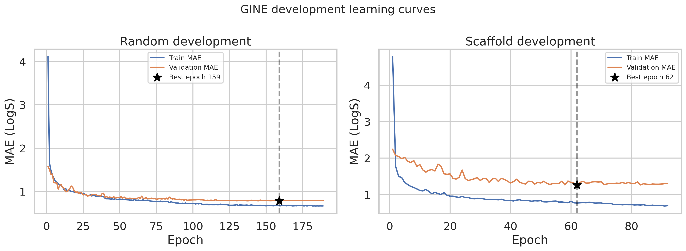
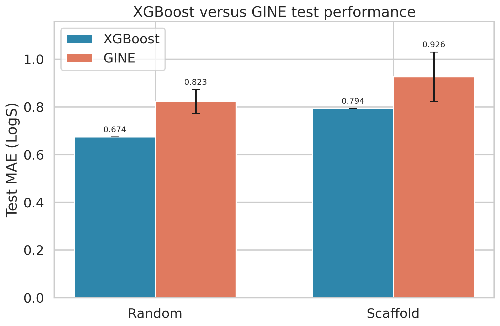
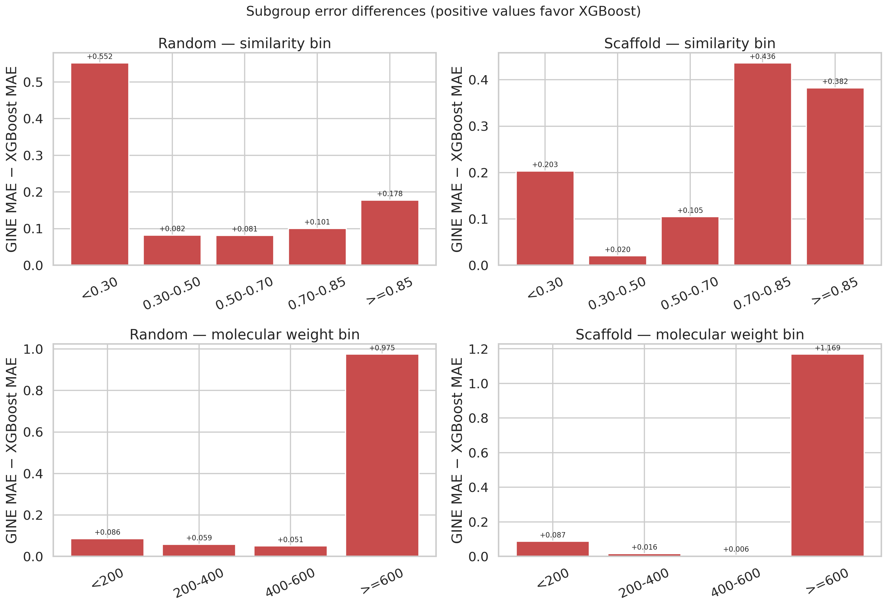
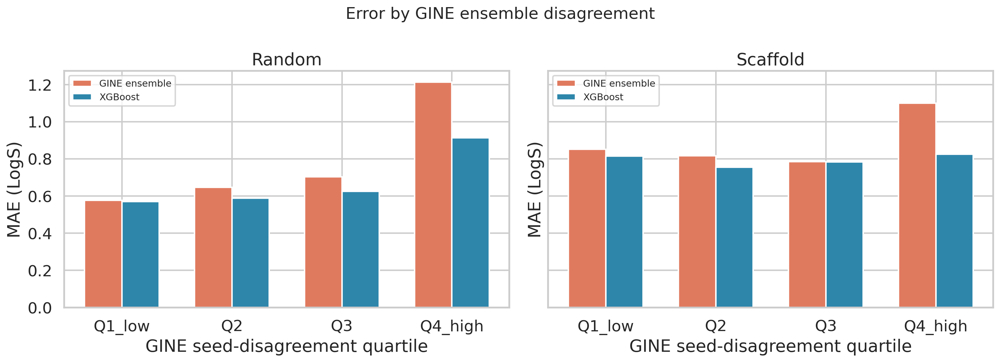
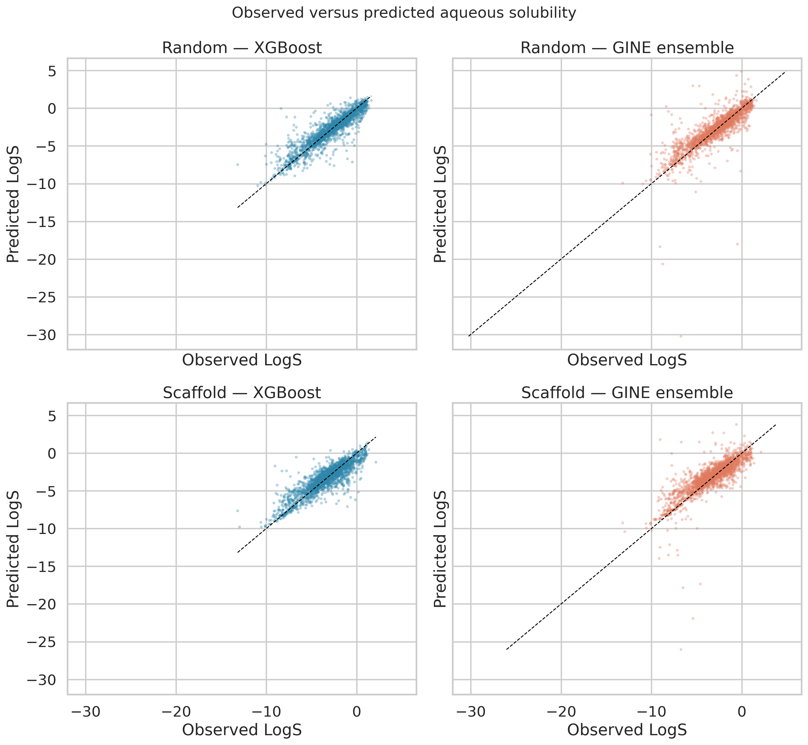

# Day 3: GINE molecular graph regression

## Executive conclusion

A four-layer GINE molecular graph model was implemented and
evaluated against the strongest Day 2 baseline for aqueous
solubility prediction. The GINE model learned a meaningful
structure-property representation, but it did not outperform
XGBoost using combined ECFP and RDKit descriptors.

On the random test protocol, the three-seed GINE mean MAE was
0.8232 ±
0.0495 (95% confidence interval),
compared with 0.6742 for XGBoost.
On the scaffold protocol, the corresponding values were
0.9264 ±
0.1040 for GINE and
0.7944 for XGBoost.

Averaging the predictions from the three GINE seeds improved MAE
to 0.7847
on the random test set and
0.8879
on the scaffold test set. The ensembles nevertheless remained
worse than XGBoost.

The evidence therefore supports XGBoost as the production
candidate for this dataset and GINE as a research baseline.

## Task and data

The task predicts aqueous solubility LogS in log10(mol/L) from
canonical molecular SMILES. The complete AqSolDB benchmark
contains 9,982 samples.

Two protocols were retained:

| Protocol | Development train | Development valid | Fixed test | Purpose |
|---|---:|---:|---:|---|
| Random | 6,986 | 999 | 1,997 | In-distribution diagnostic |
| Scaffold | 5,045 | 2,940 | 1,997 | Chemical-structure generalization |

The official scaffold validation set has an unusual composition:
all 2,940 validation molecules have an empty Bemis-Murcko
scaffold. The fixed scaffold test set contains unseen cyclic
scaffolds. This distribution shift is retained and documented
rather than silently replaced.

## Molecular graph representation

Canonical SMILES were converted to directed molecular graphs.
Atoms are nodes and bonds are represented in both directions.

Node features include atomic number, degree, total valence,
formal charge, hybridization, aromaticity, and chirality. Edge
features include bond type, conjugation, ring membership, and
stereochemistry.

The graph cache contains 9,982 graphs, 173,500 atoms and 352,000
directed edges. It includes 149 zero-edge graphs and 1,098
multi-fragment structures. No fragments were removed and no
charges were neutralized, preserving the official benchmark
definition.

## Model and training

The main graph model is a four-layer GINE regressor with hidden
dimension 128, sum pooling and dropout 0.15. It contains 305,541
trainable parameters.

Training used AdamW, Huber loss on standardized LogS targets,
gradient clipping, validation-MAE early stopping, and a
ReduceLROnPlateau scheduler. The target scaler was fitted only on
the corresponding training data and stored in each checkpoint.

A 32-sample overfitting diagnostic reached MAE 0.0166, confirming
that the graph, optimization, checkpoint and inverse-scaling
pipeline can learn and recover predictions correctly.

## Development results

| Protocol | Best epoch | Validation MAE | RMSE | R2 | Spearman | Training time |
|---|---:|---:|---:|---:|---:|---:|
| Random | 159 | 0.7803 | 1.1745 | 0.7623 | 0.8999 | 145.8 s |
| Scaffold | 62 | 1.2587 | 1.7840 | 0.4515 | 0.7227 | 69.3 s |

The random learning curves show a modest train-validation gap.
The scaffold development run has a much larger gap, consistent
with its stronger distribution shift.



## Final fixed-test comparison

The best epoch was selected without using the test set. A fresh
model was then trained on train plus validation for that fixed
number of epochs. Final experiments used predetermined seeds
1, 2 and 3.

| Protocol | Model | Test MAE | RMSE | R2 | Spearman |
|---|---|---:|---:|---:|---:|
| Random | XGBoost combined | 0.6742 | 1.0257 | 0.8102 | 0.9032 |
| Random | GINE, 3-seed mean | 0.8232 | 1.4380 | 0.6260 | 0.8758 |
| Random | GINE ensemble | 0.7847 | — | — | — |
| Scaffold | XGBoost combined | 0.7944 | 1.1066 | 0.7674 | 0.8559 |
| Scaffold | GINE, 3-seed mean | 0.9264 | 1.4379 | 0.6072 | 0.8498 |
| Scaffold | GINE ensemble | 0.8879 | — | — | — |



The single-seed GINE runs required on average
118.7 seconds for 159 random
epochs and 47.0 seconds for
62 scaffold epochs. Peak allocated GPU memory was below
73.7 MB.
The model is therefore computationally inexpensive on an RTX
3080.

## Paired statistical comparison

The ensemble and XGBoost predictions were compared molecule by
molecule using 10,000 paired bootstrap resamples.

| Protocol | GINE − XGBoost MAE | Paired bootstrap 95% CI | GINE sample win rate |
|---|---:|---:|---:|
| Random | 0.1105 | [0.0692, 0.1575] | 45.9% |
| Scaffold | 0.0935 | [0.0522, 0.1377] | 47.3% |

Both confidence intervals are entirely above zero. The observed
XGBoost advantage is therefore stable under paired test-set
resampling.

## Chemical-space error analysis

Nearest-neighbor similarity was calculated using ECFP4 Tanimoto
similarity against the complete final training set. Errors were
also stratified by scaffold status, molecular weight and the
predefined drug-like applicability domain.

No predefined subgroup had a lower mean GINE MAE than XGBoost.
The closest random subgroup was
`molecular_weight_bin: 400-600`,
where the MAE difference was
0.0506.
The closest scaffold subgroup was
`molecular_weight_bin: 400-600`,
where the difference was
0.0056.

For scaffold molecules with molecular weight 400-600, GINE and
XGBoost were nearly tied, and GINE had a sample-level win rate
slightly above 50%. This is a local observation rather than
evidence of overall GINE superiority.



## Uncertainty and applicability domain

The standard deviation of predictions across the three GINE
seeds was evaluated as a simple disagreement score.

On the random protocol, GINE MAE increased from
0.5763 in the lowest-disagreement
quartile to 1.2127 in the highest.
On the scaffold protocol it increased from
0.8507 to
1.0993.

However, the continuous Spearman relationship between
disagreement and error was weak for random data and absent for
scaffold data. Seed disagreement should therefore be treated as
a high-risk flag, not as a calibrated uncertainty estimate.



## Failure analysis

The largest GINE errors were dominated by structures outside the
intended drug-like domain.

For the random protocol, 16
of the top 20 failures were outside the drug-like scope and
14 were multi-fragment structures.
For the scaffold protocol, the corresponding counts were
15 and
12; 14
of the top 20 had molecular weight at least 600.

The most extreme failures include very large mixtures, inorganic
metal-containing compounds, disconnected salts, and unusual
single-atom structures. Sum pooling can produce graph embeddings
whose magnitude grows with atom and fragment count, contributing
to unstable extrapolation for these samples.



## Model-selection decision

For this approximately 10,000-sample property-prediction task,
XGBoost with ECFP and explicit RDKit descriptors is preferred.
Descriptors such as LogP, molecular weight and TPSA provide
high-value physical priors directly, whereas the GINE model must
learn related global quantities indirectly from labels.

GINE remains useful when larger datasets, molecular
pretraining, multitask supervision, or learned graph embeddings
are available. A future preregistered experiment could assess a
hybrid model that concatenates the GINE graph embedding with
global molecular descriptors. Such an experiment must use a new
validation protocol and must not tune against the test results
reported here.

## Reproduction

```bash
python scripts/build_graph_cache.py

python scripts/train_gine_development.py \
  --protocol random --device cuda:0

python scripts/train_gine_development.py \
  --protocol scaffold --device cuda:0

python scripts/train_gine_final.py \
  --protocol random --device cuda:0

python scripts/train_gine_final.py \
  --protocol scaffold --device cuda:0

python scripts/analyze_gine_subgroups.py
python scripts/plot_day3.py
python scripts/summarize_day3.py
```

## Validity statement

The fixed test labels were not used for architecture selection,
early stopping or epoch selection. Test-set inspection began only
after the model architecture and development protocol were
frozen. No post-test GINE tuning is reported.
