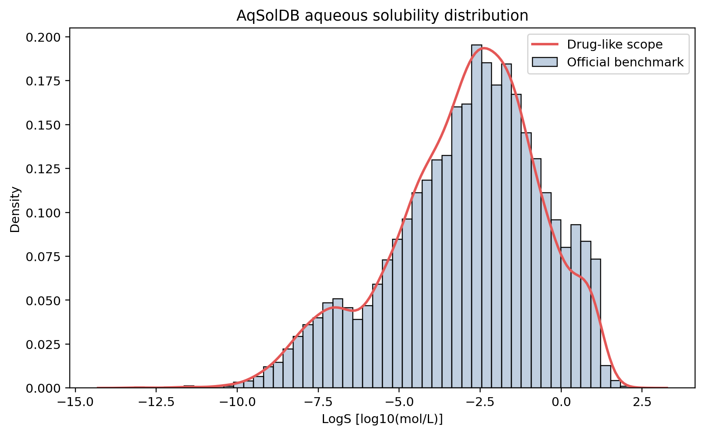
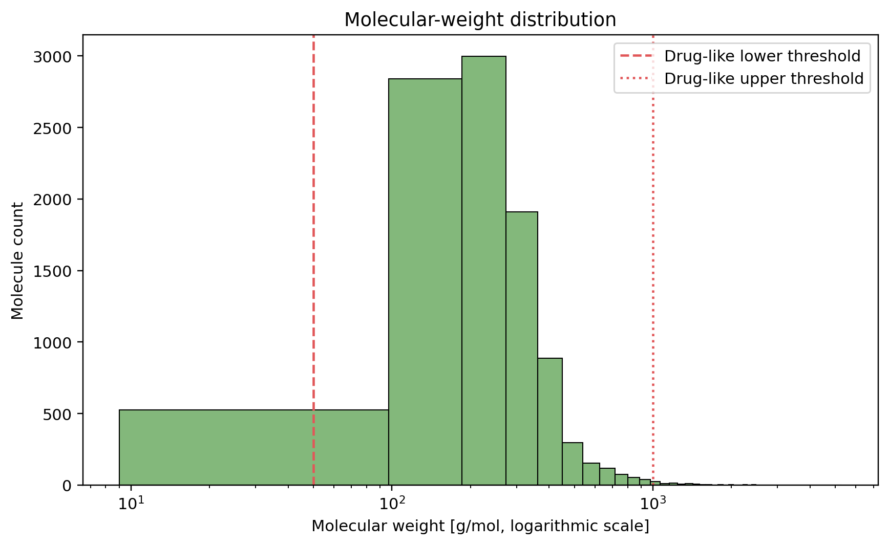
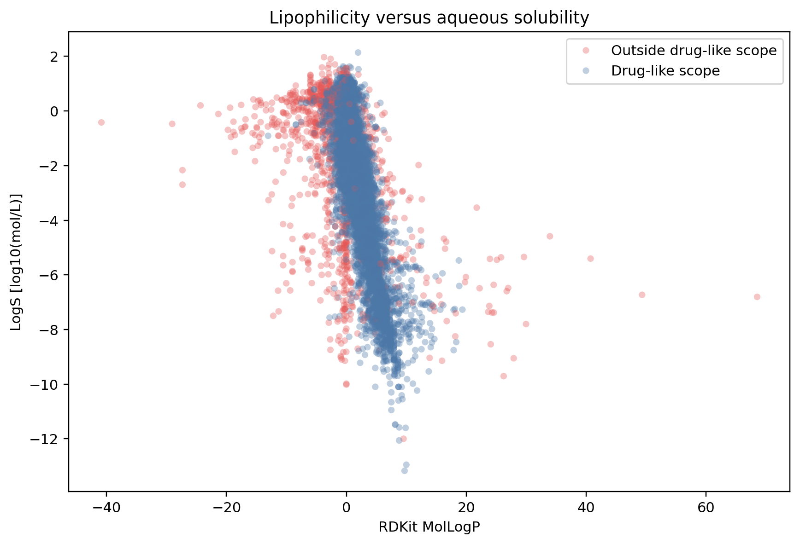
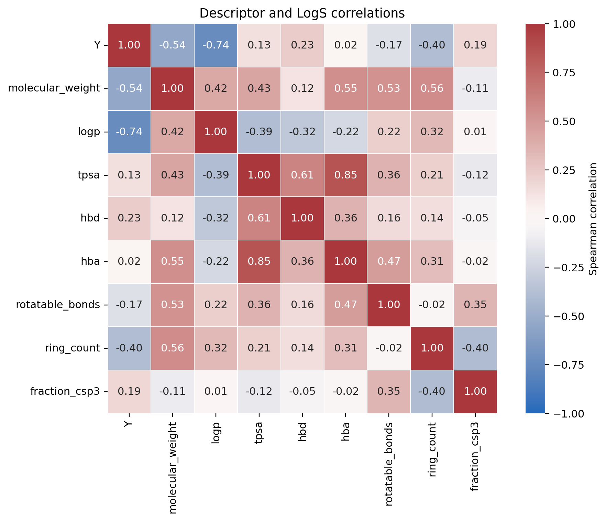

# AqSolDB exploratory data analysis

## Dataset definition

- Task: aqueous solubility regression
- Input: molecular SMILES
- Label: LogS
- Unit: log10(mol/L)
- Official benchmark samples: 9,982
- Drug-like analysis samples: 8,721
- Drug-like proportion: 87.37%

## Label statistics

| Scope | Mean | Median | Standard deviation | Minimum | Maximum |
|---|---:|---:|---:|---:|---:|
| Official benchmark | -2.8899 | -2.6182 | 2.3682 | -13.1719 | 2.1377 |
| Drug-like scope | -3.0113 | -2.7100 | 2.2998 | -13.1719 | 2.1377 |

## Molecular statistics

| Property | Median | 1st percentile | 99th percentile | Maximum |
|---|---:|---:|---:|---:|
| Molecular weight | 228.68 | 59.82 | 955.16 | 5299.46 |
| MolLogP | 1.95 | -8.99 | 11.14 | 68.54 |
| TPSA | 50.72 | 0.00 | 311.49 | 1214.34 |

## Spearman correlation with LogS

| Descriptor | Correlation with LogS |
|---|---:|
| logp | -0.7399 |
| molecular_weight | -0.5386 |
| ring_count | -0.3969 |
| hbd | 0.2300 |
| fraction_csp3 | 0.1871 |
| rotatable_bonds | -0.1737 |
| tpsa | 0.1330 |
| hba | 0.0234 |

## Data-quality findings

- All raw SMILES were successfully parsed by RDKit.
- Canonicalization did not create duplicate structures.
- Salts, mixtures, ions, and uncommon elements remain in the official benchmark.
- No fragments were removed and no charges were neutralized.
- The drug-like scope is an analysis flag, not a replacement for the official benchmark.
- Molecular-weight and structural extremes indicate that applicability-domain checks are necessary.

## Figures

### Label distribution

### Molecular-weight distribution

### Lipophilicity versus solubility

### Descriptor correlations

